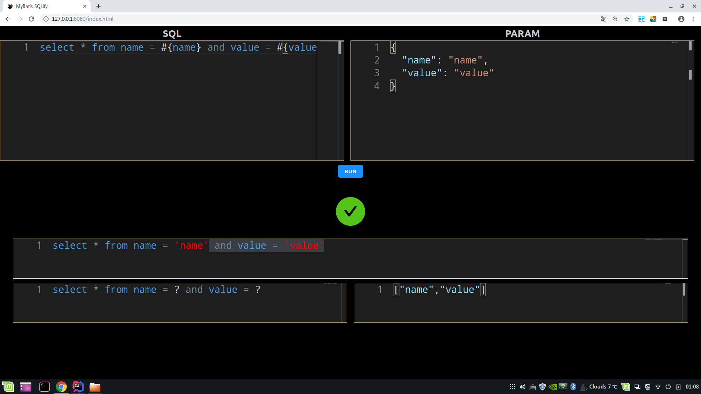

# mybatis-sqlify

## 功能

查看 Mybatis 对 Sql 的动态处理结果

## 背景

`mapper.xml` 的 `SQL` 中除了`SQL`语句外，还有赋值语句( `xx=#{xx}`)、判断语句(`<if test=...>`)、 循环语句（`<for ...>`）...夹杂在一起肉眼很难找出 SQL 拼接过程中的 笔误或 BUG。

本工具可通过输入 Mybatis 的 **SQL** 和 **参数** 获取数据库**最终执行的 SQL**

## 下载

[mybatis-sqlify.jar](https://github.com/tanghuibo/mybatis-sqlify/raw/master/bin/mybatis-sqlify.jar)

## 使用

- 输入 MyBatis 的 **SQL**
- 输入的 **PARAM**
- 点击 **RUN**



## 原理

### 核心步骤

1. SqlifyServiceImpl#process 将 `MyBatis SQL` 写入上下文
2. Mapper 利用 `SelectProvider` 将 上下文中的 `MyBatis SQL` 动态拼接成待执行 SQL
3. SqlLogInterceptor 拦截 SQL，将被拦截 SQL 和参数写入上下文

### 核心代码

mapper: `SqlifyMapper`

```java
 /**
  * 通过 SqlProvider#run动态获取sql并运行
  * @param param
  * @return
  */
@Lang(XMLLanguageDriver.class)
@SelectProvider(type = SqlProvider.class, method = "run")
Object run(Object param);

class SqlProvider {
    /**
     * 动态sql拼接
     * @return
     */
    public String run() {
        //1. 从上下文中获取sql
        String sql = SqlifyContext.getSqlifyRequest().getMybatisSql();
        //拼接sql
        return String.format("<script>%s</script>", sql);
    }
}
```

service 方法: `SqlifyServiceImpl#process`

```java
//1. 设置context
SqlifyContext.setSqlifyRequest(request);
//2. 运行mybatis的mapper
sqlifyMapper.run(request.getParam());
//3. 获取返回值
return SqlifyContext.getSqlifyResponse();
```

Mabatis SQL 拦截: `SqlLogInterceptor`

```java
private void setSqlifyResponse(BoundSql boundSql, Configuration configuration) {
    SqlifyResponse response = new SqlifyResponse();
    //1. 获取参数替换前sql
    response.setSqlRenderBefore(getSqlRenderBefore(boundSql));
    //2. 获取参数
    response.setParam(getParam(boundSql, configuration));
    //3. 参数替换
    response.setSqlRenderAfter(getSqlRenderAfter(response.getSqlRenderBefore(), response.getParam()));
    //4. 设置上下文
    SqlifyContext.setSqlifyResponse(response);
}
```
